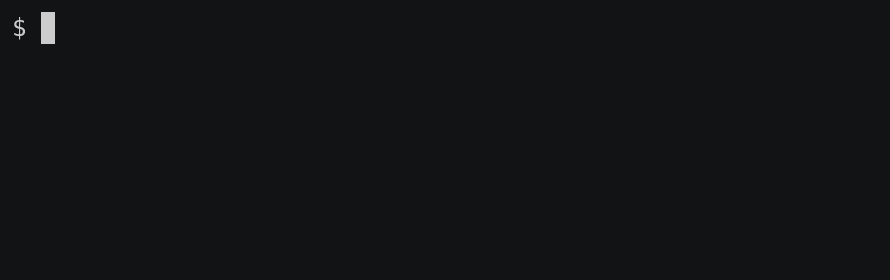
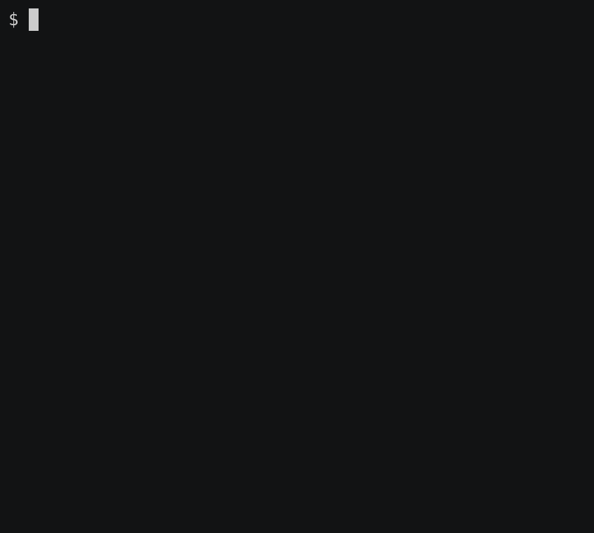

 

Here we have patched GNU Make 4.3 sources to add improved error reporting, tracing, target listing, graph visualization, profiling, and more. It also
contains a [debugger](https://remake.readthedocs.io/en/latest/debugger.html). Branches [`remake-4-2`](https://github.com/rocky/remake/tree/remake-4-2), [`remake-4-1`](https://github.com/rocky/remake/tree/remake-4-1), [`remake-3-82`](https://github.com/rocky/remake/tree/remake-3-82), and [`remake-3-81`](https://github.com/rocky/remake/tree/remake-3-81) for patched GNU Make 4.2, 4.1, 3.82, and 3.81 respectively.

See the [readthedocs guide](https://remake.readthedocs.io/en/readthedocs/index.html) for information, including `remake` [features](https://remake.readthedocs.io/en/readthedocs/features.html), and [installation](https://remake.readthedocs.io/en/readthedocs/install.html).

The [wiki](https://github.com/rocky/remake/wiki) also has information, including links to videos, and information for developers.

Example showing `--tasks` feature:

Example showing `--trace` (short option `-x) feature:

Example showing `--show-parent` (short option `-c`) feature:

Example showing `--profiling` output (displayed via [KCachegrind](https://kcachegrind.github.io/html/Home.htmlkcachegrind)):

