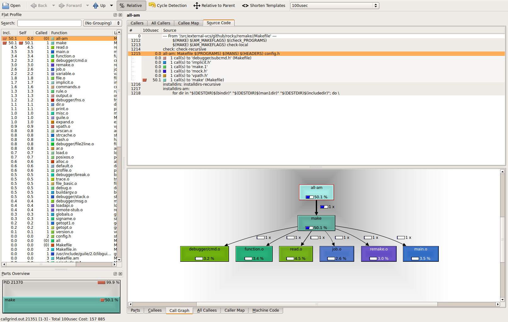

.. contents:: :local:

Features
========

Although debugging GNU Makefiles is a little different than debugging, procedure-oriented
programming languages, this debugger tries similar to other_ trepanning_ debuggers_ and *gdb*
in general. So knowledge gained by learning this is transferable to those
debuggers and vice versa.

Profiling
---------

If you want to know where most of the time goes in building your system with Makefiles,
there is a `--profile` option which times the targets.

This option creates Callgrind Profile Format_ output which can be read
by KCachegrind_, callgrind_annotate_, or gprof2dot_ or other tools that understand this format.

You can get not only timings, but a graph of the target dependencies
checked. Below is an image rendered from a profiling of a `remake` build:

Listing and Documenting Makefile Targets
----------------------------------------

Have you ever wanted `rake tasks` for GNU Make?  That is, you have
some strange `Makefile` and you want to see the interesting targets,
that you can run "make *target-name*" on?

There are two new options added to `remake` to assist this:

* `--tasks`  gives a list of "interesting" targets
* `--targets` gives a list of *all* targets

Before each target in the Makefile, you can give add a one-line comment
describing what the target does, starting the comment with `#:`.

If you do this, when either of these options is shown it will also be shown
with next to the target name.

Here is an example. Consider this `Makefile`:

.. code:: Makefile

    #: This is the main target
    all:
  	@echo all here

    #: Test things
    check:
	@echo check here

    #: Build distribution
    dist:
	@echo dist here

Running `remake --tasks` gives:

.. code:: console

    all                  This is the main target
    check                Test things
    dist                 Build distribution

Searching for a Makefile in Parent Directories
----------------------------------------------

When the `-c` flag is given (or `--search-parent`), if a Makefile or
goal target isn't found in the current directory, `remake` will search
in the parent directory for a Makefile. On finding a parent the
closest parent directory with a Makefile, `remake` will set its current working
directory to the directory where the Makefile was found.

In this respect the short option `-c`, is like `-C` except no
directory need to be specified.

Here is a screenshot that shows `make` behavior versus `remake`:

.. image:: ../screenshots/remake-search-parent.gif

Improved Execution Tracing
--------------------------

When the `-x` flag is given (or `--trace=normal`), any commands that
are about to be run are shown as seen in the `Makefile` along with
`set -x` tracing when run in a POSIX shell. Also, we override or
rather ignore, any non-echo prefix `@` directive listed at the
beginning of target commands.

If different granularity of tracing is desired the `--trace` option
has other settings. See the relevant parts of this manual for more information.

And, if you the most flexibility in tracing there is a built-in debugger.

Here is a screenshot that shows tracing:

.. image:: ../screenshots/remake-search-parent.gif

Debugger
--------

Features of the debugger:

* Inspect target properties
* See the current target stack
* Set breakpoints
* Set and expand GNU Make variables
* Load in Makefiles
* write a shell script containing the target commands with GNU Make variables expanded away, so the
  shell code can be run (and debugged) outside of make.
* Enter debugger at the outset, call it from inside a Makefile, or enter it upon the first error

See  :ref:`debugger <debugger>` for more information on the built-in debugger.

For Developers
--------------

If you are interested in learning about how GNU Make works, you might find it easier to start out working with this code.

First, some Doxygen_ comments have been added.

Second, it has been simplified as a result of the removal of lesser-used OS's (from the standpoint of GNU Make use).

We don't even attempt to support:

* VMS (whether on VAX_ or the OpenVMS_  variant)
* DOS (with or without EMX_ and DJGCC_),
* native MS/Windows,
* acornOS_
* Amiga_,
* OS2_
* MINIX_,
* RiscOS_
* Xenix_

This is 2020, not the late 1970-80's. Although GNU make is phasing some of these out out you can find C-preprocessor checks and C code in GNU Make for the above.

By eliminating support for the above, thousands of lines of code in support of the above has been removed.

And the remaining code is easier to read.

Sure, it has annoyed (and still annoys?) those who still work on and develop on the above. I get it. If it is any consolation, there is still GNU Make or GNU Make in older versions for such people.

However the *way* this code has been added makes already difficult-code to read even more difficult.

For example here is GNU Make 4.3 code from `job.c`

.. code:: cpp

    #if !defined(__MSDOS__) && !defined(_AMIGA) && !defined(WINDOWS32)
            remote_status_lose:
    #endif
              pfatal_with_name ("remote_status");
            }
          else
            {
              /* No remote children.  Check for local children.  */
    #if !defined(__MSDOS__) && !defined(_AMIGA) && !defined(WINDOWS32)
              if (any_local)
                {
    #ifdef VMS
                  /* Todo: This needs more untangling multi-process support */
                  /* Just do single child process support now */
                  vmsWaitForChildren (&status);
                  pid = c->pid;

                  /* VMS failure status can not be fully translated */
                  status = $VMS_STATUS_SUCCESS (c->cstatus) ? 0 : (1 << 8);

                  /* A Posix failure can be exactly translated */
                  if ((c->cstatus & VMS_POSIX_EXIT_MASK) == VMS_POSIX_EXIT_MASK)
                    status = (c->cstatus >> 3 & 255) << 8;
    #else
    #ifdef WAIT_NOHANG
                  if (!block)
                    pid = WAIT_NOHANG (&status);
                  else
    #endif
                    EINTRLOOP (pid, wait (&status));
    #endif /* !VMS */

Can you spot which code is used in the most-often POSIX unixy case? In some cases
such as in the above, the most-often case is indented incorrectly because in
of one of less-frequent cases it is say in an `else` clause (as appears above).

*Note: If you have trouble parsing the above, the Pygments parser used
in this document has trouble too.  Even after adding mismatched braces in
the above for context, I couldn't get Pygments to parse this after
specifying C source with C-preprocessor directives. So I gave up, and
opted for the slightly shorter source code without some enclosing braces.*

I understand how this ugly code hard-to-read code most likely came
about in GNU Make. Been there and done that myself too.

In the early days to gain traction and support, a project wants to
support lots of different platforms and OS's, even obscure ones. To
get going, you'll probably do that in the most expedient way.

But again, that was then and this is now.

If there are folks in the affected communities that would like `remake` added and are willing to code and do the testing, I am open to this. But *it needs to be added in a more modular way than was done in the past*.

Overall, I view this as a plus for developers who would like to extend GNU Make or understand the code.

.. _Amiga: https://en.wikipedia.org/wiki/Amiga
.. _DJGCC: https://en.wikipedia.org/wiki/DJGPP
.. _EMX: https://en.wikipedia.org/wiki/EMX_(programming_environment)
.. _Format: https://valgrind.org/docs/manual/cl-format.html
.. _KCachegrind: https://kcachegrind.github.io/html/Home.html
.. _MINIX: https://en.wikipedia.org/wiki/MINIX
.. _OS2: https://en.wikipedia.org/wiki/OS/2
.. _OpenVMS: https://en.wikipedia.org/wiki/OpenVMS
.. _RiscOS: https://en.wikipedia.org/wiki/RISC_OS
.. _VAX: https://en.wikipedia.org/wiki/VAX
.. _Xenix: https://en.wikipedia.org/wiki/Xenix
.. _acornOS: https://9to5mac.com/2017/01/06/apple-history-acorn-a-virtual-click-wheel-based-os-which-lost-out-to-ios-shown-in-its-2006-era-glory-video/
.. _callgrind_annotate: http://man7.org/linux/man-pages/man1/callgrind_annotate.1.html
.. _debuggers: https://metacpan.org/pod/Devel::Trepan
.. _gprof2dot: https://github.com/jrfonseca/gprof2dot
.. _other: https://www.npmjs.com/package/trepanjs
.. _pygments:  http://pygments.org
.. _pygments_style:  http://pygments.org/docs/styles/
.. _this: http://bashdb.sourceforge.net/pydb/features.html
.. _trepanning: https://pypi.python.org/pypi/trepan2
.. _Doxygen: http://www.doxygen.nl/
