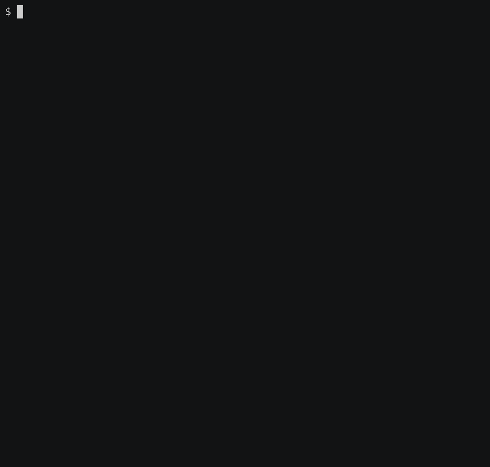

The "cast" screenshots were made with `asciienea`. For example:

```
$ asciinema rec remake-session1.cast
```

and then running through `asciicast2gif`.

You can edit the `.cast` files. The specific commands used after this were:

```console
$ asciicast2gif -w 60 -h 16 remake-session.cast  remake-session0.gif
$ asciicast2gif -w 57 -h 20 remake-session1.cast remake-session1.gif
$ asciicast2gif -w 57 -h 10 remake-session2.cast remake-session2.gif
```
